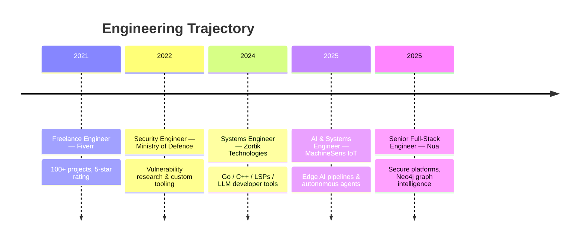

<!-- ═══════════════════════════════════════════════════════════════════════ -->
<!--  MIRZA AREEB BAIG  ·  github.com/trixtipsfix                          -->
<!-- ═══════════════════════════════════════════════════════════════════════ -->

<div align="center">


<a href="https://github.com/trixtipsfix">
  
</a>

<br/>


</div>


<!-- ═══════════════════════════════════ SYSTEM BOOT ═══════════════════════ -->

## `01` &nbsp;▍ SYSTEM ONLINE

```console
areeb@blackbox:~$ whoami --verbose

┌─[ IDENTITY ]───────────────────────────────────────────────────────────┐
│  name        : Mirza Areeb Baig                                        │
│  role        : Senior Full-Stack Engineer  @ Nua  (Riyadh, KSA)        │
│  parallel    : AI & Systems Engineer       @ MachineSens IoT (Dubai)   │
│  origin      : Islamabad, Pakistan  ·  Remote-native                   │
│  degree      : BS Cyber Security — Air University  (GPA 3.61 / 4.00)   │
│  cert        : eCPPTv2 — Certified Professional Penetration Tester     │
└────────────────────────────────────────────────────────────────────────┘

┌─[ CORE DIRECTIVES ]────────────────────────────────────────────────────┐
│  ▸ architect secure, scalable platforms end-to-end                     │
│  ▸ ship autonomous AI agents that reason, decide and act               │
│  ▸ break systems before attackers do — then harden them                │
│  ▸ turn complexity into something a human can actually read            │
└────────────────────────────────────────────────────────────────────────┘

areeb@blackbox:~$ status
▸ 100+ delivered projects  ·  ★★★★★ rating  ·  4 countries  ·  0 downtime tolerated
```


<!-- ═══════════════════════════════════ ARSENAL ══════════════════════════ -->

## `02` &nbsp;▍ TECH ARSENAL

<div align="center">

#### ⟨ LANGUAGES ⟩


#### ⟨ FRAMEWORKS & FRONTEND ⟩


#### ⟨ DATA & IDENTITY ⟩


#### ⟨ CLOUD, DEVOPS & INFRA ⟩


#### ⟨ AI · AUTOMATION · OFFENSIVE SECURITY ⟩

<p>


<br/>


<br/>


</p>

</div>


<!-- ═══════════════════════════════════ PROJECTS ═════════════════════════ -->

## `03` &nbsp;▍ FLAGSHIP BUILDS

<table>
<tr>
<td width="50%" valign="top">

### 🤖 Shax
**`Autonomous AI Penetration Tester`**

An end-to-end offensive-security agent that **discovers, validates and prioritizes real vulnerabilities** through safe exploitation — expert-level pentesting at machine speed.

`Agentic AI` `LLMs` `Python` `Exploitation`

</td>
<td width="50%" valign="top">

### 🧿 Paradox AI
**`Online Misinformation Detection Platform`**

Multimodal agent that verifies credibility across **text, images, audio and video** — NLP, deepfake detection and content analysis in real time.

`MCP` `LLMs` `ML` `Python` `APIs`

</td>
</tr>
<tr>
<td width="50%" valign="top">

### 🧬 DARTS
**`Dynamic Analysis Real-Time Sandbox`**

Instrumented sandbox for **dynamic analysis of Windows malware** using the Unicorn Engine, live instrumentation and memory inspection.

`C/C++` `Unicorn` `ML` `Python`

</td>
<td width="50%" valign="top">

### 📄 MAD
**`Macro Analysis & Detection Tool`**

AI-powered static + dynamic engine that **detects and classifies malicious Office macros** for threat hunting and incident response.

`AI` `ML` `VBA` `Python`

</td>
</tr>
<tr>
<td width="50%" valign="top">

### 🎣 PhishIntel
**`Phishing Email Detection`**

ML pipeline that flags phishing by dissecting **metadata, text patterns and embedded URLs** before a human ever clicks.

`ML` `LLMs` `Python`

</td>
<td width="50%" valign="top">

### 🚩 CTF Platform
**`Capture-the-Flag Infrastructure`**

Full-featured CTF platform with **isolated challenge hosting**, team management, scoring and real-time monitoring.

`Flask` `JavaScript` `Docker`

</td>
</tr>
</table>


<!-- ═══════════════════════════════════ TIMELINE ═════════════════════════ -->

## `04` &nbsp;▍ EXECUTION TIMELINE



<details>
<summary><b>▶ &nbsp;EXPAND FULL DEPLOYMENT LOG</b></summary>

<br/>

| Period | Role | Organization | Mission |
|:---|:---|:---|:---|
| `09/2025 → now` | **Senior Full-Stack Software Engineer** | Nua — Riyadh, KSA | Secure, scalable apps in Django / Next.js / Node.js · Neo4j graph analytics · REST + GraphQL for real-time cybersecurity intelligence · CI/CD, Docker, testing · security dashboards |
| `02/2025 → now` | **AI & Systems Engineer** | MachineSens IoT — Dubai, UAE | End-to-end AI pipelines for IoT · autonomous decision-making agents for industrial automation · LLM-driven anomaly detection & NL sensor querying · edge + cloud inference optimization |
| `02/2024 → 02/2025` | **Systems Engineer** | Zortik Technologies — Remote, Canada | Secure systems in Go, Python, C/C++, TypeScript · LSPs, bootstrapping frameworks, LLM-integrated developer tools · Docker & AWS automation |
| `02/2022 → 02/2024` | **Security Engineer** | Ministry of Defence — Rawalpindi, PK | In-house vulnerability discovery & reporting automation · web + internal pentests · R&D in application and infrastructure security |
| `2021 → now` | **Freelance Engineer** | Fiverr — Remote | 100+ five-star projects across web, automation and cybersecurity · pentesting & scraping tooling · AWS + Docker deployments |

</details>


<!-- ═══════════════════════════════════ TROPHIES ═════════════════════════ -->

## `05` &nbsp;▍ TROPHY VAULT

<div align="center">

| 🏆 | Achievement | Arena |
|:--:|:---|:---|
| 🥇 | **Winner — AirTech'24 CTF Competition** | Air University |
| 🌍 | **Finalist — Black Hat MEA 2023 · 2024 · 2025** | SAFCSP, Saudi Arabia |
| 🥈 | **1st Runner-Up — SOFTEC'24 CTF** | FAST NUCES, Lahore |
| 🥉 | **2nd Runner-Up — Digital Pakistan Cybersecurity Hackathon (Finals) 2023** | Ministry of IT |
| 🥈 | **1st Runner-Up — Air University CTF 2023** | Air University |
| 🎓 | **Best Performer of the Batch** · Merit Scholarship | Air University (BS Fall-21) |
| 💻 | **Prime Minister's Youth Laptop Award 2023** | Government of Pakistan |

</div>


<!-- ═══════════════════════════════════ TELEMETRY ════════════════════════ -->

## `06` &nbsp;▍ TELEMETRY

<div align="center">


<br/>


<br/><br/>


<br/>


</div>


<!-- ═══════════════════════════════════ CONNECT ══════════════════════════ -->

## `07` &nbsp;▍ ESTABLISH CONNECTION

<div align="center">

```console
areeb@blackbox:~$ ./connect.sh --open-to "high-impact engineering + security work"
[+] handshake complete — channels below are live
```

<a href="mailto:whoamirza@gmail.com">
  
</a>
<a href="https://www.linkedin.com/in/whoamirza">
  
</a>
<a href="https://github.com/trixtipsfix">
  
</a>
<a href="https://www.fiverr.com/">
  
</a>

<br/><br/>

> ### ⟨ `"I build systems that solve real problems — and simplify complexity."` ⟩

<br/>


</div>
